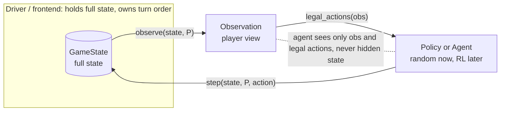

# Hanoi Crossing

A two-player, partially-observable Tower of Hanoi variant: a pure game engine
plus two frontends (replay a recorded game, or watch random self-play).

## Game

- Players A and B, three poles each. The middle pole (`SHARED`) is shared; A also
  owns `A1`/`A3`, B owns `B1`/`B3`.
- Each player starts with N disks on their pole 1, largest at the bottom. A gets
  the odd sizes (1, 3, …, 2N-1), B the even sizes (2, 4, …, 2N). Every size is
  unique across both players, so any two disks always have a strict order.
- On your turn you do one thing: lift the top disk of a visible pole into your
  hand, place your held disk onto a visible pole (normal Hanoi rule), or skip.
  You hold at most one disk. An illegal action just wastes the turn.
- You can't see or touch the opponent's poles 1 and 3, or their hand.
- Turn order comes from outside the engine; the engine assumes nothing about it.
- You win when your hand is empty and, of your visible poles, only pole 3 has
  disks on it.
- Either player can lift from `SHARED`, so a disk can end up stranded on the
  opponent's hidden side.

## Quickstart

```bash
uv sync

hanoi replay examples/spec_n1.moves
hanoi replay examples/win_via_opponent.moves --trace   # board after each move
hanoi random --n 3 --seed 7
hanoi random --n 3 --seed 7 --turn-order random
```

## Design decisions

Where the rules were ambiguous I picked something and wrote down why. Full
write-ups are in `docs/design-decisions/`; running notes are in `docs/DEVLOG.md`.

| Topic | Decision |
|---|---|
| Win condition (`0001`) | Literal and visible-only: hand empty, pole 1 empty, `SHARED` empty, pole 3 non-empty. No disk ownership or counting. If your disks get stranded, you just can't satisfy it. |
| Terminal (`0002`) | After each step, check both players. The first win freezes the game (later moves are no-ops). If both somehow win on one move, the mover wins. `is_win` is a public query, reused internally. |
| Pole naming | Player-relative: each player only ever names pole 1/2/3 (2 = `SHARED`). Hidden info falls out of this; you can't even name the opponent's poles. |
| Immutability | `GameState` is a frozen, dict-free pydantic model (one tuple field per pole plus the two hands), so nothing can be mutated in place. |
| Replay input | Line DSL: `<player> <verb> [pole]`, `#` comments, `n <N>` header. |
| Output | JSON plus an ASCII board. |

## Architecture

`step(state, player, action)` is the one transition, and it's a pure function
over immutable state: no I/O, no global RNG, nothing mutated. An agent only ever
gets an `Observation` and the legal actions, never the full state.



Because of that, the same engine can back an RL loop or a many-game simulation
service without changes. `initial_state`/`observe` are reset and observation,
`step` gives you the next state and whether the game ended, and immutable states
are cheap to snapshot and safe to share. The random player is written the way an
external agent would be: it sees only the observation and the legal actions.

## Public API

```python
from hanoi.engine import initial_state, observe, legal_actions, step, is_win

state = initial_state(n)
obs   = observe(state, player)        # only the player's own poles + hand
acts  = legal_actions(obs)            # pure on the observation
res   = step(state, player, action)   # new state + was_legal/terminal/winner
won   = is_win(state, player)
state.model_dump_json()
```

## Formats

Input (replay DSL, self-contained):

```
# comments start with '#'; blank lines are ignored
n <N>                    # disks per player; must be the first real line
<player> <verb> [pole]   # one move per line
```

`player` is A or B (case-insensitive), and the player column is the turn order.
`verb` is lift, place, or skip (lift/place take a pole 1/2/3; skip takes none).
Bad input fails immediately, with the line number.

Output (board + JSON):

```
  A1: -              A3: 1              hand A: -
  SHARED: -
  B1: -              B3: -              hand B: 2
steps: 3   illegal moves: 0   winner: A
{ "n": 1, "a1": [], "a3": [1], ..., "terminal": true, "winner": "A" }
```

Poles read bottom to top; `-`/`[]` is empty; `illegal moves` counts wasted
turns. The JSON is the full state for programs.

## Layout

```
src/hanoi/
  engine/     # pure core (< 500 lines): state, actions, observation, rules
  io/         # replay DSL parsing
  cli/        # Typer app: hanoi replay, hanoi random
  players/    # seeded random policy over (obs, legal_actions)
tests/        # engine + frontend tests
examples/     # sample .moves files
docs/         # design decisions, DEVLOG
```

## Development

```bash
uv run pytest               # tests + coverage (gate 80%)
uv run ruff check .
uv run ruff format .
uv run pre-commit install   # ruff + hygiene on commit; tests run in CI
```

## Future work

None of this is built (the brief said not to), but the following would be
worthwhile.

### Performance

Replaying 1M moves takes about 14s and ~1GB here, mostly per-step allocation.

- Replacing the internal legality check (which builds an observation and up to 7
  action objects every step) with a plain `is_legal(state, player, action)`
  predicate would be the biggest win.
- `model_construct` instead of `model_copy` on the copy path, plus a lighter
  `StepResult`, would cut allocation further.
- A batched `step` (many games at once) would help training throughput.

### Robustness

- `model_validate_json` trusts its input today, so a loaded state is not checked
  for disk conservation, pole ordering, or `n >= 1`; a `model_validator` plus
  `Field(ge=1)` would close that.
- Bounding N and replay length would prevent the out-of-memory a huge N causes.

### RL environment

The core already exposes reset/observation, the transition, and the legal
actions.

- An action-to-index map and a fixed-size observation encoder would be needed
  (variable-length tuples cannot feed a network).
- A small Gymnasium `Env` wrapper would then sit on top. The random player
  already consumes the engine at that boundary.

### Simulation service

Immutable states are thread-safe, so this is mostly plumbing.

- A game store keyed by id, a version tag on the serialized state, and a thin
  API over `step` that persists `model_dump_json()` would be enough to run many
  concurrent games.

### Tooling

- mypy and bandit in CI would add type and security checks.
- Structured logging in the frontends would help (the engine stays pure).

### Deployment

- The package is uv/pip-installable with a `hanoi` entry point (`uvx hanoi …`,
  or `pip install .`). A service would containerise the same package behind an
  API and a state store.

## AI usage disclosure

Per the brief, I used Claude (Claude Code) for brainstorming the design and the
ambiguous-rule interpretations, for writing the test cases, and for code review.
I wrote the implementation, and the design decisions were mine (they're in
`docs/design-decisions/` and `docs/DEVLOG.md`).

## License

[MIT](LICENSE)
