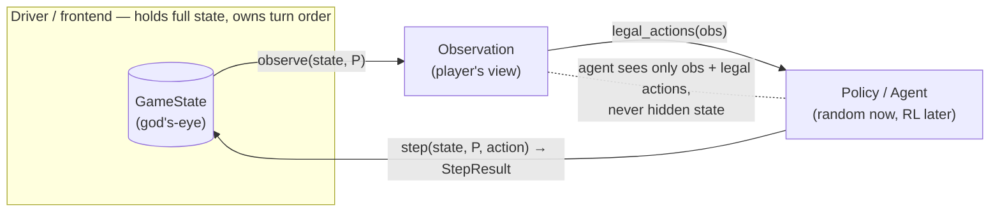

# Hanoi Crossing

A turn-based, two-player, partially-observable variant of Tower of Hanoi, with a
pure reusable game engine and two frontends (replay, random-play).

## Game

- Two players **A** and **B**. Five poles: A owns `A1, A3`; B owns `B1, B3`;
  `SHARED` (the "middle" pole) is visible to and usable by both.
- Each player starts with **N** disks on their pole 1 (largest at bottom).
  A holds odd sizes `1, 3, …, 2N-1`; B holds even sizes `2, 4, …, 2N`, so all
  `2N` sizes are globally unique and any two disks have a strict order.
- One action per turn: **Lift** (top disk of a visible pole → hand), **Place**
  (held disk → a visible pole, standard Hanoi rule), or **Skip**. At most one
  disk in hand. An illegal action leaves the state unchanged and wastes the turn.
- A player cannot see or touch the opponent's poles 1 and 3, nor their hand.
- Turn order is supplied externally; the engine assumes no pattern.
- **Win:** hand empty and, among a player's visible poles, only pole 3 has disks.
- Either player can lift from `SHARED`, so a disk can be stranded on the
  opponent's hidden side.

## Design decisions

Full write-ups in `docs/design-decisions/`.

| # | Decision |
|---|----------|
| Win condition (`0001`) | **Literal / visible-only:** win ⇔ `hand empty ∧ pole1 empty ∧ SHARED empty ∧ pole3 non-empty`. No disk-ownership or count tracking. |
| Terminal semantics (`0002`) | Check **both** players after every step; **freeze on first win** (`terminal` flag, later moves are no-ops); simultaneous win ⇒ the player who just moved wins. `is_win` is a public pure query used internally. |
| Pole addressing | **Player-relative** (`pole 1/2/3`, pole 2 = `SHARED`); visibility enforced structurally; both players share one symmetric 7-action space. |
| Replay input | Line DSL (`<player> <verb> [pole]`, `#` comments, `n <N>` header). |
| State output | JSON (god's-eye) + ASCII board. |

## Architecture

The engine is a pure function `step(state, player, action) → StepResult` over
immutable state. Agents receive only an `Observation` and the legal actions —
never the full state — so the same engine serves an RL loop or a concurrent
simulation service unchanged.



## Package structure

```
src/hanoi/
  engine/         # pure core (< 500 lines)
    state.py        # GameState, Player, initial_state, serialization
    actions.py      # Lift / Place / Skip
    rules.py        # legal_actions, step, is_win, terminal logic
    observation.py  # Observation, observe
  io/             # DSL parsing + validation
  cli/            # Typer app: `hanoi replay`, `hanoi random`
  players/        # seeded random policy over (obs, legal_actions)
tests/            # engine unit + property-based + frontend tests
docs/             # design decisions, DEVLOG
```

## Usage

```bash
uv sync
hanoi replay game.moves
hanoi random --n 3 --seed 7 [--turn-order random] [--max-steps M]
```

Replay input example:

```
# N=1 win example from the spec
n 1
A lift 1
B lift 1
A place 3
```

## Development

```bash
uv run pytest --cov=hanoi   # tests + coverage (target ≥ 80%)
uv run ruff check .         # lint
uv run ruff format .        # format
```

## AI usage disclosure

Development used Claude (Claude Code) for design brainstorming, documentation,
and code review. Design decisions and interpretations were made collaboratively
and are recorded in `docs/design-decisions/`.

## License

[MIT](LICENSE)
