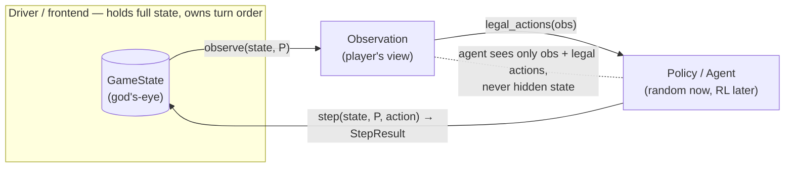

# Hanoi Crossing

A turn-based, two-player, partially-observable variant of Tower of Hanoi, with a
pure, reusable game engine and two frontends (replay, random-play).

## Game

- Two players **A** and **B**. Five poles: A owns `A1, A3`; B owns `B1, B3`;
  `SHARED` (the "middle" pole) is visible to and usable by both.
- Each player starts with **N** disks on their pole 1 (largest at bottom).
  A holds odd sizes `1, 3, …, 2N-1`; B holds even sizes `2, 4, …, 2N`, so all
  `2N` sizes are globally unique and any two disks have a strict order.
- One action per turn: **Lift** (top disk of a visible pole → hand), **Place**
  (held disk → a visible pole, standard Hanoi rule), or **Skip**. At most one
  disk in hand. An illegal action leaves the state unchanged and wastes the turn.
- A player cannot see or touch the opponent's poles 1 and 3, nor their hand.
- Turn order is supplied externally; the engine assumes no pattern.
- **Win:** hand empty and, among a player's visible poles, only pole 3 has disks.
- Either player can lift from `SHARED`, so a disk can be stranded on the
  opponent's hidden side.

## Quickstart

```bash
uv sync                                          # create the venv, install

hanoi replay examples/spec_n1.moves              # replay a recorded game
hanoi replay examples/win_via_opponent.moves --trace   # print the board after each move
hanoi random --n 3 --seed 7                      # random self-play (reproducible)
hanoi random --n 3 --seed 7 --turn-order random  # non-alternating turn order
hanoi --help
```

## Design decisions

Where the brief left rules open, I made a decision and documented it. Full
write-ups are in `docs/design-decisions/`; the journey is in `docs/DEVLOG.md`.

| # | Decision |
|---|----------|
| Win condition (`0001`) | **Literal / visible-only:** win ⇔ `hand empty ∧ pole1 empty ∧ SHARED empty ∧ pole3 non-empty`. No disk-ownership or count tracking. A player whose disks get stranded simply cannot satisfy it. |
| Terminal semantics (`0002`) | Check **both** players after every step; **freeze on first win** (`terminal` flag, later moves are no-ops); a simultaneous win goes to the player who just moved. `is_win` is a public pure query used internally. |
| Pole addressing | **Player-relative** (`pole 1/2/3`, pole 2 = `SHARED`); visibility is enforced structurally; both players share one symmetric 7-action space. |
| Immutability | `GameState` is a **frozen, dict-free** pydantic model (per-pole tuple fields + hand fields), so no field can be mutated in place. |
| Replay input | Line DSL (`<player> <verb> [pole]`, `#` comments, `n <N>` header). |
| State output | JSON (god's-eye) + an ASCII board. |

## Architecture

`step(state, player, action) → StepResult` is the single pure transition over
immutable state — no I/O, no global RNG, no mutation. Agents receive only an
`Observation` and the legal actions, never the full state.



**Reuse (RL loop / concurrent sim).** Because the core is pure, immutable, and
serializable, and because agents already consume it only through
`observe → legal_actions → step`, it can serve unchanged as:

- an **RL environment** — `initial_state`/`observe` are the reset/observation,
  `step` returns the next state + terminal/winner, immutable state snapshots
  trivially; and
- a **concurrent simulation service** — immutable states are safe to share
  across many games with no locking.

The random player (`hanoi.players.choose_action`) is deliberately written the
way such an external agent would be: it sees only the `Observation` and the
legal actions.

## Public API

```python
from hanoi.engine import initial_state, observe, legal_actions, step, is_win

state = initial_state(n)                 # GameState
obs   = observe(state, player)           # Observation (own poles + hand only)
acts  = legal_actions(obs)               # list[Action]  (pure on the observation)
res   = step(state, player, action)      # StepResult: new state + was_legal/terminal/winner
won   = is_win(state, player)            # bool
state.model_dump_json()                  # serialization
```

## Formats

### Input — replay DSL (self-contained)

```
# comments start with '#'; blank lines are ignored
n <N>                    # header: disks per player (required, first line)
<player> <verb> [pole]   # one move per line
```

- `player`: `A` | `B` (case-insensitive). The player column **is** the turn order.
- `verb`: `lift` | `place` | `skip` (`lift`/`place` take a pole `1/2/3`; `skip` takes none).
- Malformed input fails fast with the offending line number.

### Output — board + JSON

```
  A1: -              A3: 1              hand A: -
  SHARED: -
  B1: -              B3: -              hand B: 2
steps: 3   illegal moves: 0   winner: A
{ "n": 1, "a1": [], "a3": [1], "b1": [], "b3": [], "shared": [],
  "hand_a": null, "hand_b": 2, "terminal": true, "winner": "A" }
```

Poles list disks **bottom → top**; `-`/`[]` is empty; `illegal moves` counts
wasted (illegal) turns. The JSON is the full state for machine consumers.

## Package structure

```
src/hanoi/
  engine/         # pure core (< 500 lines): state, actions, observation, rules
  io/             # replay DSL parsing + validation
  cli/            # Typer app: `hanoi replay`, `hanoi random`
  players/        # seeded random policy over (obs, legal_actions)
tests/            # engine + frontend tests
examples/         # sample .moves files
docs/             # design decisions, DEVLOG
```

## Development

```bash
uv run pytest               # tests + coverage (gate ≥ 80%)
uv run ruff check .         # lint
uv run ruff format .        # format
uv run pre-commit install   # ruff + hygiene on commit (tests run in CI)
```

## Future work

The engine is complete and correct; these are the paths to production and to the
reuse cases the brief describes (deliberately not built here).

**Performance (the RL-critical `step` loop).** Replaying 1M moves takes ~13.6 s /
~1.1 GB here, dominated by per-step allocation.
- Replace the internal legality check (`action in legal_actions(observe(...))`,
  which allocates an observation + up to 7 action objects every step) with an
  allocation-free `is_legal(state, player, action)` predicate — the largest
  single win.
- Use `model_construct` (not `model_copy`) on the copy-on-write path and make
  `StepResult` a `slots`/`NamedTuple`; for maximum throughput keep pydantic at
  the boundary only. A vectorised/batched `step` (many games at once) would help
  training throughput further.

**Robustness.** `model_validate_json` currently trusts input, so a loaded state
isn't checked for disk conservation, pole ordering, or `n ≥ 1`. Add a
`model_validator` + `Field(ge=1)`, and bound `N` and replay length at the
boundaries (a pathologically large `N` OOMs by design today).

**RL environment.** The core already exposes reset/observation
(`initial_state`/`observe`), transition (`step` → terminal/winner), and
`legal_actions`. To make it agent-ready: add an action ↔ discrete-index map and a
fixed-size `encode_observation(obs)` (variable-length tuples can't feed a
network), then a thin Gymnasium `Env` wrapper (`reset`/`step` → obs, reward,
terminated, truncated, info). The random player already consumes the engine
exactly as such an agent would — an RL agent swaps in at the same boundary.

**Concurrent simulation service.** Immutable states are thread-safe, so this is
mostly plumbing: a game store (`id → GameState`), a serialization schema version
for forward-compat, and a thin API (e.g. FastAPI) that calls `step` and persists
`model_dump_json()` to Redis/a DB.

**Tooling.** Add `mypy` and `bandit` to CI/pre-commit; structured logging in the
frontend/service layer (the engine stays pure).

**Deployment.** The package is uv/pip-installable with a `hanoi` entry point
(`uvx hanoi …`, or `pip install .` then `hanoi …`); a service containerises the
same package and exposes `step` behind an API + a state store.

## AI usage disclosure

Per the brief, disclosing AI tool usage. I used Claude (Claude Code) for:

- **brainstorming** — exploring the design and settling the interpretation of
  the ambiguous rules (win condition, terminal semantics, formats);
- **writing the test cases**; and
- **code review** — prioritised feedback on correctness, immutability, and edge
  cases.

I wrote the implementation. The design decisions were mine and are recorded in
`docs/design-decisions/` and `docs/DEVLOG.md`.

## License

[MIT](LICENSE)
